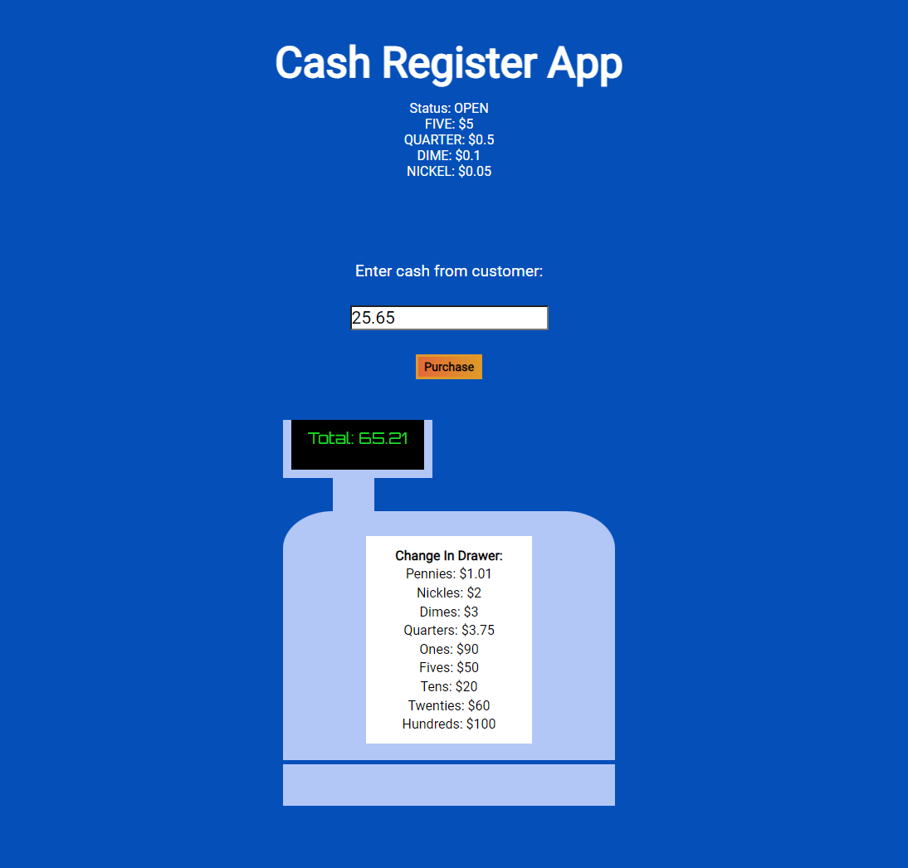

# About

A web application that allows for a user to "purchase" an item via its given price. Information will be displayed to the user depending on their input.
It includes management for conditions where:
 - The provided input is less than the price of the item
 * The input is the same value as the price of the item
 + Change is due to the user and displayed and updated by denomination in the register
 - Change cannot be provided

 # Getting Started

 1. Download the files and store in a directory on your computer.
 2. Copy the path to the index.html file in the directory.
 3. Open your browser of choice.
 4. Paste the path into your address bar.
 5. Enter a number into the input
 6. Click the button to pay for your product or window-shop (there isn't much on display at this store 😉) 

 # To-Do

- [ ] Create items to shop for
- [ ] Condense some of the logic
